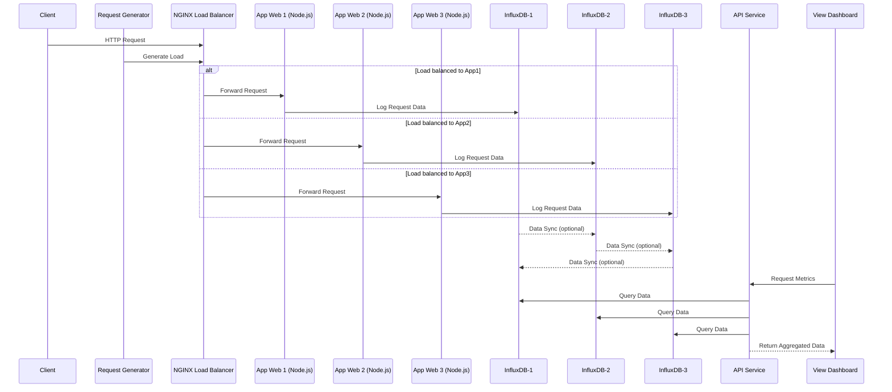

# HELLO

```mermaid
sequenceDiagram
    participant Client
    participant RequestGen as Request Generator
    participant NGINX as NGINX Load Balancer
    participant App1 as App Web 1 (Node.js)
    participant App2 as App Web 2 (Node.js)
    participant App3 as App Web 3 (Node.js)
    participant DB1 as InfluxDB-1
    participant DB2 as InfluxDB-2
    participant DB3 as InfluxDB-3
    participant API as API Service
    participant View as View Dashboard

    Client->>NGINX: HTTP Request
    RequestGen->>NGINX: Generate Load

    alt Load balanced to App1
        NGINX->>App1: Forward Request
        App1->>DB1: Log Request Data
    else Load balanced to App2
        NGINX->>App2: Forward Request
        App2->>DB2: Log Request Data
    else Load balanced to App3
        NGINX->>App3: Forward Request
        App3->>DB3: Log Request Data
    end

    DB1-->>DB2: Data Sync (optional)
    DB2-->>DB3: Data Sync (optional)
    DB3-->>DB1: Data Sync (optional)

    View->>API: Request Metrics
    API->>DB1: Query Data
    API->>DB2: Query Data
    API->>DB3: Query Data
    API-->>View: Return Aggregated Data

```
