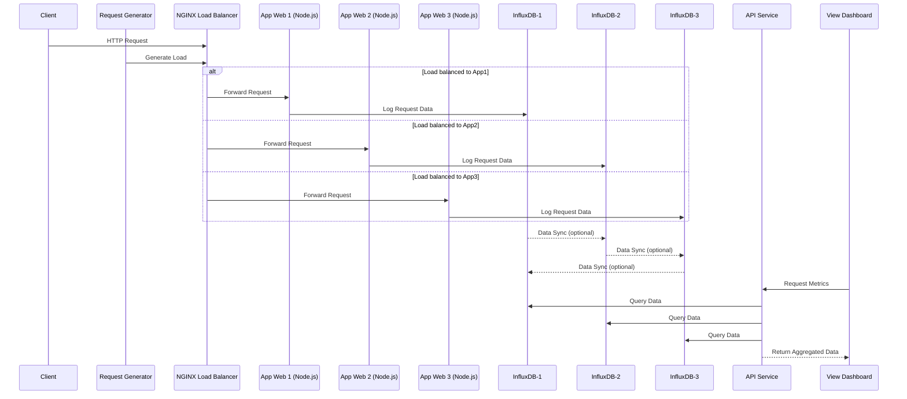

# Dự án phân tán

**Theo dõi lượng request của trang web**

## 1. Mô tả đề tài

Hệ thống web hiện đại thường được triển khai theo mô hình **phân tán**, nhằm mục tiêu mở rộng (scalability), tăng khả năng chịu lỗi (fault tolerance) và đáp ứng lượng người dùng lớn. Một vấn đề đặt ra trong các hệ thống như vậy là **giám sát lưu lượng truy cập** theo thời gian thực, đặc biệt là trong môi trường có **cân bằng tải (load balancing)**, nơi mỗi máy chủ backend chỉ biết đến một phần lưu lượng.

Đề tài này đề xuất xây dựng một hệ thống **giám sát lưu lượng request theo mỗi giây (requests per second - RPS)** sử dụng:

- **InfluxDB**: cơ sở dữ liệu chuỗi thời gian (time-series database) để ghi nhận và phân tích dữ liệu request.
- **NGINX**: đóng vai trò cân bằng tải và có khả năng ghi log request.
- **Docker Compose**: để triển khai toàn bộ hệ thống theo kiến trúc phân tán.
- **Node.js backend (hoặc ứng dụng web)**: nơi tạo ra request hoặc thu thập từ log.

## 2.Các thành phần của hệ thống

**Client:**

- Người dùng hoặc chương trình tạo request đến hệ thống qua NGINX.

**NGINX Load Balancer:**

- Cân bằng tải giữa 3 web server (app-1, app-2, app-3) theo round-robin hoặc IP-hash.

- Giúp phân phối đồng đều request vào backend, đảm bảo không có server nào bị quá tải.

**App Web 1, 2, 3 (Node.js):**

- Mỗi container Node.js xử lý request đến từ NGINX.

- Sau mỗi request, ghi log hoặc thống kê số lượng request vào InfluxDB tương ứng (influxdb-1, influxdb-2, influxdb-3).

- Có thể định danh mỗi server bằng biến môi trường NAME.

**InfluxDB 1, 2, 3:**

- Mỗi app có 1 cơ sở dữ liệu riêng biệt để lưu trữ lượng truy cập (theo mô hình sharding phân tầng).

- Các InfluxDB có thể liên kết (cluster hoặc liên thông) để thực hiện tổng hợp dữ liệu nếu cần.

- Dữ liệu gồm các trường: timestamp, count, server_name, path,...

**API:**

- Dịch vụ trung gian dùng để đọc dữ liệu từ InfluxDB.

- Truy vấn từ cả 3 DB (hoặc tổng hợp dữ liệu) để gửi về client UI.

**View:**

- Giao diện người dùng (frontend) để trực quan hóa dữ liệu (sử dụng biểu đồ, số liệu, v.v.).

**Request:**

- Module tự động sinh request mô phỏng người dùng thật.

- Gửi request tuần tự hoặc ngẫu nhiên qua NGINX để đo lượng tải phân phối.

---

## 3.Biểu đồ

